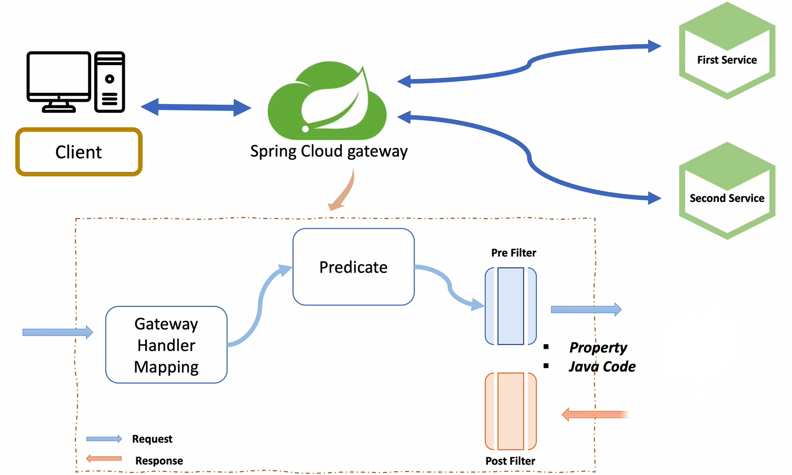
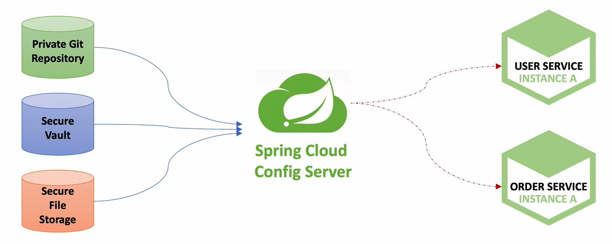

### Spring Cloud Netflix Eureka
* 모든 마이크로스 서비스는 Spring Cloud Netflix Eureka 에 등록한다.   
* Service Discovery 
    - 외부에서 다른 서비스들이 마이크로 서비스를 검색하기 위해서 사용하는 개념 (전화번호부 같은 역할)
    - Eureka 가 하는 역할
* 각 마이크로 서비스가 자신의 위치 정보를 Eureka 서버에 등록해서 사용한다.
    - 클라이언트는 자신이 필요한 요청 정보를 API Gateway 에 전달한다.
    - 요청 정보는 Service Discovery 에 전달이 되어 필요한 마이크로 서비스의 위치 정보(ip address, port 등)를 반환한다.

### API Gateway Service
* 인증 및 권한 부여
* 마이크로 서비스 검색 통합
* 응답 캐싱
* 정책, 회로 차단기 및 QoS 다시 시도
* 속도 제한
* 부하 분산
* 로깅, 추적, 상관 관계
* 헤더, 쿼리 문자열 및 청구 변환
* IP 허용 목록에 추가

### Netflix Ribbon
* Spring Cloud 에서의 MSA 간의 통신
    1. RestTemplate
    2. Feign Client
* Ribbon: **Client side** Load Balancer
    - 서비스 이름으로 호출
    - Health Check
    - 비동기 지원이 안됨
    - Spring Boot 2.4 버전에서 maintenance 상태

### Netflix Zuul 
* Routing, Api Gateway 역할
* Spring Boot 2.4 버전에서 maintenance 상태
    - zuul 2.0 으로 업데이트 되면서 비동기를 지원하긴 하지만    
      다른 Spring Boot 라이브러리와의 호환성 문제로 Spring Cloud Gateway 로 대체
      
### Spring Cloud Gateway 
#### Filter

### port 번호 변경하는 방법
1. Edit Configurations -> VM Option -> -Dserver.port=9001
2. 터미널에서 mvn (또는 프로젝트 루트 경로에서 ./mvnw) spring-boot:run -Dspring-boot-run.jvmArguments='-Dserver.port=9001'
3. mvn clean compile package   
   java -jar -Dserver.port=9001 **./target/user-service-0.0.1-SNAPSHOT.jar (jar 파일 경로)** 
   
### Users Microservice - Security
* http.headers().frameOptions().disable();
    - h2-console 접근하기 위한 옵션
* BCryptPasswordEncoder
    - Password 를 해싱하기 위해 Bcrypt 알고리즘 사용
    - 랜덤 Salt 를 부여하여 여러번 Hash 를 적용한 암호화 방식 
    
### Spring Cloud Config
* 분산 시스템에서 서버, 클라이언트 구성에 필요한 설정 정보(application.yml)를 외부 시스템에서 관리
* 하나의 중앙화 된 저장소에서 구성요소 관리 가능
* 각 서비스를 다시 빌드하지 않고, 바로 적응 가능
* 애플리케이션 배포 파이프라인을 통해 DEV-UAT-PROD 환경에 맞는 구성 정보 사용

### Spring Cloud Bus
* 분산 시스템의 노드(Microservice)를 경량 메시지 브로커(RabbitMQ)와 연결
    + 상태 및 구성에 대한 변경 사항을 연결된 노드에게 전달(Broadcast)
* AMQP(Advanced Message Queuing Protocol) 메시지 지향 미들웨어를 위한 개방형 표준 응용 계층 프로토콜
    + 메시지 지향, 큐잉, 라우팅(P2P, Publisher-Subscriber), 신뢰성, 보안
    + Erlang, RabbitMQ 에서 사용
* Kafka 프로젝트
    + Apache Software Foundation 이 Scalar 언어로 개발한 오픈소스 메시지 브로커 프로젝트
    + 분산형 스트리밍 플랫폼
    + 대용량의 데이터를 처리 가능한 메시지 시스템
* RabbitMQ VS Kafka
    + RabbitMQ  
        - 메시지 브로커
        - 초당 20+ 메시지를 소비자에게 전달
        - 메시지 전달 보장, 시스템 간 메시지 전달
        - 브로커, 소비자 중심
    + Kafka
        - 초당 100k+ 이상의 이벤트 처리
        - Pub/Sub, Topic 에 메시지 전달
        - Ack 를 기다리지 않고 전달 가능
        - 생산자 중심
    

* rabbitmq 설치
    + brew install rabbitmq
    + export PATH=$PATH:/usr/local/sbin
    + rabbitmq-server

### Actuator bus-refresh Endpoint
* 분산 시스템의 노드를 경량 메시지 브로커와 연결
* 상태 및 구성에 대한 변경 사항을 연결된 노드에게 전달(Broadcast)

### RabbitMQ 설치 - Windows 10
1. Erlang 설치
    + https://www.erlang.org/downloads/23.1
    + 설치 후 환경변수 등록
        - C:\Program Files\erl-23.1
2. RabbitMQ 설치
    + https://www.rabbitmq.com/download.html
    + 